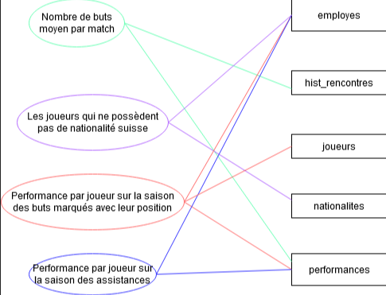
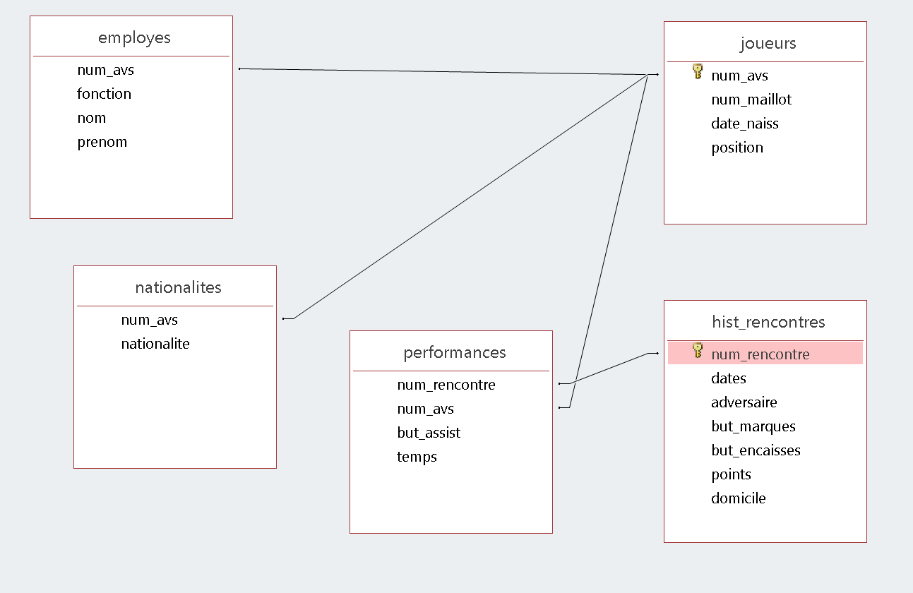
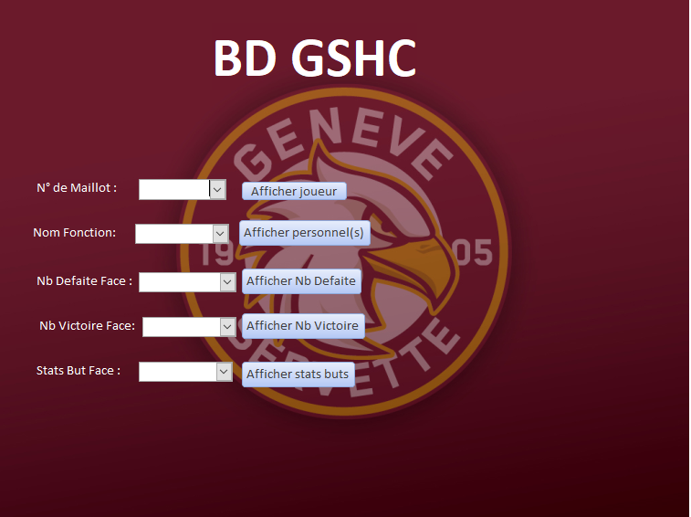

<p align="center">

<h3 align="center">GSHC database project</h3>

<div align="center">

  []()


</div>

---

<p align = "center">💡 In 2020, we have created some SQL queries</p>


## Table of Contents

- [Why we made this project?](#why_document)
- [Introduction](#intro)
- [Use case diagram](#diagram)
- [Access relationship diagram](#relationship)
- [Description of the main queries](#queries)
- [User interface elements](#interface)
- [Conclusion](#conclusion)

## Why we made this project? <a name = "why_document"></a>

- During a class on database in UNIGE, we had as a project to implement some SQL query in a concrete example. 

## Introduction<a name = "intro"></a>
- We are both fans of the Geneva Servette Hockey Club team, which is why we decided to make our project about it. 

- We chose to highlight the results of the 2019-2020 season, as well as the players.
We can use the database to make statistics on the matches played, on the goals or assists, on the nationalities of the players or their age.

- This database already allows us to observe some interesting results

- The data was collected from elite prospects, swiss ice hockey and the swiss ice hockey app. By combining the data from these three sources, we were able to build our database.

- However, one could imagine a more complex database with much more data, such as the playing time of the players, the ratio of a player on the ice (in hockey, the players are not always on the ice, so a player can have a positive ratio for a game for example +2 even if his team loses 3-2, this means that he was part of the group of 5 players on the ice at the time of the two goals, but was not present at the time of the 3 goals conceded) or any other interesting statistics.

- It is interesting to talk about the movie "money ball" inspired by a true story. In it, a baseball team uses a database to create a team with a lower budget than their opponents. Their database includes players and some of their detailed characteristics, which they use to recruit promising players using features.

- Thus, one could imagine doing the same in Switzerland with elite junior players, collecting the necessary data and creating queries. These can differ depending on the position of the player. For a defender, for example, the number of goals conceded may be more important than the number of goals scored during his time on the ice.

- Unfortunately, we did not collect data as precise as mentioned above, but we still manage to get interesting results, which we will comment on in the following.

## Use case diagram <a name = "diagram"></a>

## Access relationship diagram <a name = "relationship"></a>

## Description of the main queries <a name = "queries"></a>
- Query 1)
Assuming a match lasts 60 minutes, how often does the team score? What is the average number of goals per game?
We start by creating a "view" that will add up all the goals scored in all the matches, which we save in sum_goals_scores.

``` sql
SELECT count(*) AS [ts_buts] 
FROM performances
WHERE but_assist="but";
```
Here, we create a view that will add up the number of matches played in a "view" nb_matches_played, in our example one season so 50 matches.

```sql
SELECT count(*) AS [nb_tot_matchs]
FROM hist_rencontres; 
```

And now we use the two views created above to calculate what we wanted, i.e. the average number of goals per match and how long it takes the team on average to score a goal.


```sql
SELECT ((ts_buts)/(nb_tot_matchs)) as [nb_but_moy_par_match], (60/nb_but_moy_par_match) as [marque_tous_les_enMinutes]
from nb_matchs_joues,somme_buts_marques; 
```
- Query 2)
Which players do not have Swiss nationality?

We start by creating a "view" that will list all nationalities in list_nationalities.


```sql
SELECT DISTINCT nationalite as liste_nat
FROM nationalites; 
```
We use what we have just done to create a "view" that contains all the nationalities present in our team except the Swiss nationality, in list_nat_etr.

```sql
SELECT distinct nationalite as nat_etrangeres
from nationalites, liste_nationalites
where nationalite In (liste_nat) and nationalite <> 'suisse'; 
```

Finally, we use the two views from above to answer the question. We want the nationality to be foreign only, so the player must not have Swiss nationality, which is done with "Not In". We also use the employee table to see which players are included in the query output.
```sql
SELECT distinct nationalites.num_avs, nom, prenom, nationalite
from liste_nat_etr, nationalites, employes
where nationalites.num_avs=employes.num_avs and nationalite In (nat_etrangeres) and nationalites.num_avs Not In (
    select nationalites.num_avs
    from nationalites
    where nationalite = 'suisse'); 
```
## User interface elements <a name = "interface"></a>
You have to open the form "FormulaireGSHC" and you will arrive on this window:


The first box allows you to choose a jersey number and after clicking on the button the name, surname and date of birth of the player corresponding to the jersey number is displayed.
The second box allows you to choose a function and to display the employees having this function within the GSHC. 
The third box allows you to choose a team and to display the number of defeats against it. 
The fourth box allows you to choose a team and to display the number of victories against it. 
The fifth box allows you to choose a team and to display the number of goals conceded and scored against this team. 

## Conclusion <a name = "conclusion"></a>
In conclusion, we have detailed the relationships between the different tables created for a GSHC database. Then we looked at some of our queries, explaining them. Finally, we explained how we performed our form. Although our database is basic, it still allows us to draw some conclusions. For example, we could find out against which team GSHC has lost the most (Bern). We could also look at the performance of the players against a specific opponent and see if they have more or less difficulty in scoring. To improve our database, we could have added much more detail to the players' performances. For example, we do not take into account the number of saves/shots made by the goalkeeper during each match. So unfortunately we can only draw conclusions about the goalkeeper's performance by the number of goals conceded. 

## Built With

- Microsoft access

## Author

**Jacques Rodrigues and Julien Python**

- [Julien's profile](https://github.com/pythonjul "Julien Python")
- [Julien's email](mailto:pythonjul@gmail.com?subject=Hello "Hello!")
